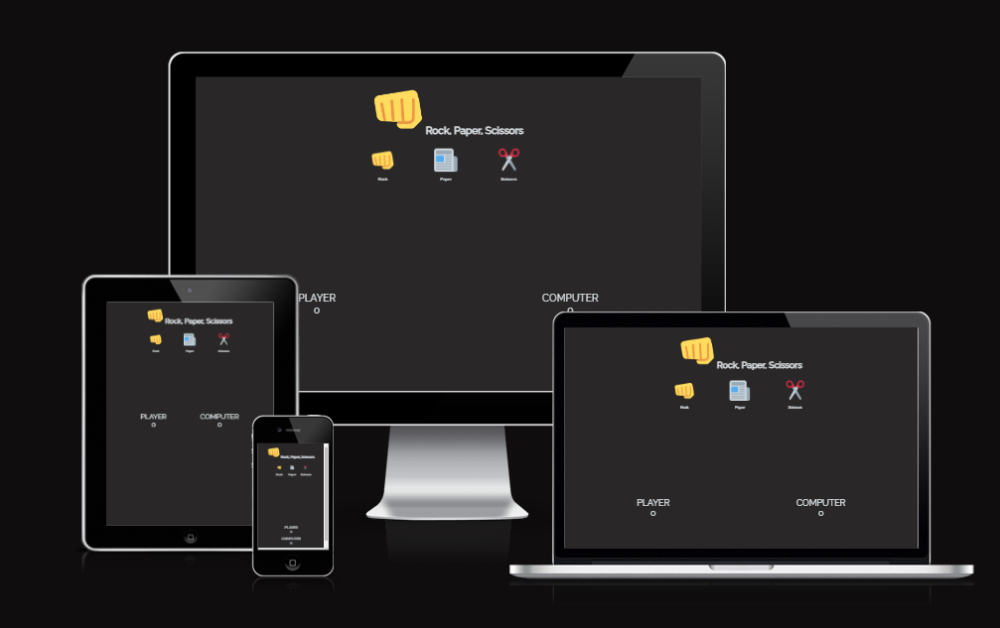

# Project2 - Rock, Paper, Scissors

For my second project with Code Institute, I have created a Rock, Paper, Scissors game.

The following is the Rules of the Game.
1. When the player comes to the page, they see 3 buttons: rock, paper, scissors
2. When the player clicks on one of the buttons, the game begins, the computer
    randomly chooses rock, paper or scissors, and the player's and computer's 
    choices are compared to see who wins.

3. The outcome of the turn is displayed on the screen.

4. Next turn begins 
5. The game ends when either of the players reaches 10 points.

<a href="https://shaneduffy91.github.io/Project1-repo/" target="_blank" aria-label="The live project">View the live project here</a>

## Features
### Existing Features

<ul> 
<li>Header</li>
        <ul>
        <li>Here we have a fist logo as part of the header, depicting rock in the rock, paper scissors game.</li>
        <li>After the heading, we have the title of the game - Rock, Paper Scissors.</li>
        </ul>
         

<li>The Landing Page / Home Page</li>
This is a one page website that consists of the following features:
        <ul>
        <li>Firstly, we have three clickable icons, a fist, a newspaper and a pair of scissors.</li>
        <li>The user clicks on one of these icons to begin the game.<li>
        <li>One the game begins, in the middle of the screen below the icons, we have a display that shows the player's choice and the computer's choice. This display also shows the outcome of the turn. 
        <li>At the bottom of the screen is the scoring area. This displays the player score and the computer score.<li>
        </ul>
         
 

  
 

## Testing
I have tested the website using the Google Chrome and Microsoft Edge Browsers on a Windows PC. I can confirm that it works on both.
I have used the Chrome Developer tool to check the website for responsiveness. I can conclude that the website works on different screen 
sizes ranging from Desktop to iphone SE screen sizes.

 
 

### Validator testing
The W3C Markup Validator and the W3C CSS Validator were used to validate all pages of the project. All syntax errors were fixed 
apart from the minor bugs on the form.html page.
<ul>
        <li>
        HTML
        <ul><li>When passing the HTML code throught the W3C validator, no errors were returned.</li></ul>
        </li>
        <li>
        CSS
        <ul><li>When passing the CSS code through the W3C validator, no errors were returned.</li>
        </ul>
        </li>
        <li>
        <li>JavaScript
        <ul><li>There are 8 functions in this file.</li>
            <li>When passing the JS code through the JS Hint validator, no errors were returned. 
            </li>
        </ul>
        </li>
        <li>
        Lighthouse
        <ul>
        <li></li>
        </ul>
        </li>
</ul>

## Deployment
The website was deployed to GitHub pages using the following steps:
<ul>
<li>Login to Github, find and click on the GitHub repository.</li>
<li>In the GitHub repository, click on the settings icon.</li>
<li>On the settings page, go to the menu on the left and click on pages.</li>
<li>Under "Source", select branch "Main" and select "Root" folder.</li>
<li>Click Save. The page will automatically refresh and the link to the published site will appear.</li>
<li>This site is published at  https://shaneduffy91.github.io/Project1-repo/</li>
</ul> 

## Credits
<ul>
<li>Code Institue: GitHub Template</li>
<li>Code Institute: Love Maths Walkthrough Project</li>
<li>Brian Macharia: Code Institute Mentor</li>
</ul>

